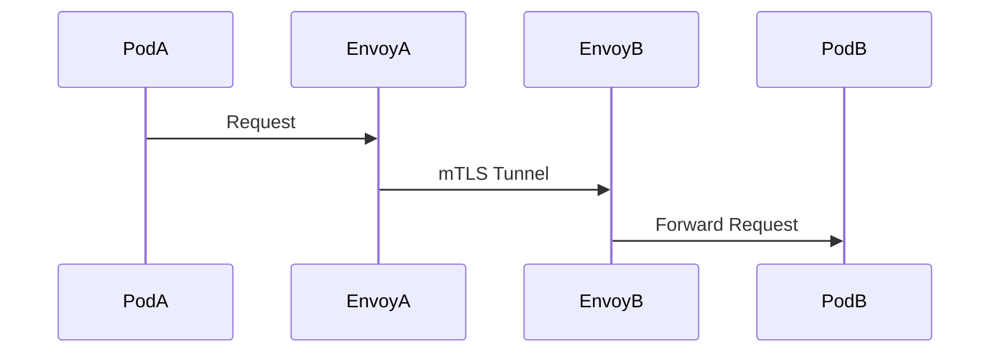

# Istio Identity Model (mTLS)

## System Diagram
The following Mermaid.js sequence diagram maps the core workflow and interactions:




This document outlines how Istio achieves zero-trust networking using Mutual TLS (mTLS) without requiring any changes to application code.

## The Problem with Kubernetes NetworkPolicies
Standard Kubernetes `NetworkPolicies` operate at Layer 3/Layer 4 (IP addresses and ports). They control *which* pods can communicate but they do not:
1. Provide cryptographic proof of *who* is communicating.
2. Encrypt traffic in transit.

## The Istio Solution: SPIFFE and SVIDs
Istio secures microservice communication through a robust identity model based on the SPIFFE (Secure Production Identity Framework for Everyone) standard.

### 1. Identity Provisioning
When a pod starts in an Istio-enabled namespace, the Istio control plane (Istiod) provisions a cryptographic identity for the pod. This identity is a X.509 certificate known as an **SVID (SPIFFE Verifiable Identity Document)**.

The SVID is tied directly to the Kubernetes `ServiceAccount` of the pod. For example:
`spiffe://cluster.local/ns/default/sa/frontend`

### 2. Transparent mTLS
Istio uses Envoy sidecar proxies deployed alongside every application container. When the `frontend` service attempts to call the `orders` service:
1. The `frontend` application makes a standard, unencrypted HTTP call to `orders`.
2. The `frontend`'s Envoy sidecar intercepts this call.
3. The Envoy sidecar initiates an mTLS handshake with the `orders` Envoy sidecar.
4. During the handshake, both proxies present their SVIDs. They cryptographically verify each other against the Istio root Certificate Authority.
5. If verified, the traffic is encrypted, sent over the wire, decrypted by the `orders` proxy, and forwarded to the `orders` application as standard HTTP.

### 3. Fine-Grained Authorization
Because every connection is authenticated with an SVID, Istio can enforce Layer 7 authorization policies. 

In our `authorization-policies.yaml`, we use this identity:
```yaml
rules:
- from:
  - source:
      principals: ["cluster.local/ns/default/sa/orders"]
```
This rule ensures that the `payments` service will *only* accept traffic if the incoming connection presents a valid SVID belonging to the `orders` service account. Even if the `frontend` pod manages to reach the `payments` pod on the network layer, the Envoy proxy will reject the connection because the identity does not match.
